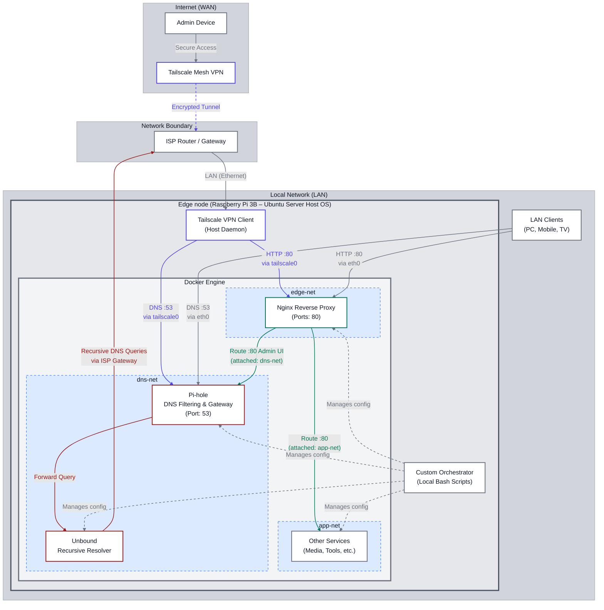

# Homelab

Evergreen homelab project focused on building and evolving a private, self-hosted local infrastructure.

The primary goals are:
- continuous hands-on learning,
- infrastructure automation,
- and maximizing privacy and local control.

This repository serves as both:
- a real operational environment,
- and a long-term engineering playground for experimenting with infrastructure, networking, automation, and self-hosting concepts.

---

# Environment

## Application Server
- Raspberry Pi 3B running Ubuntu Server
- Docker engine for self-hosted services
- Tailscale node for secure remote network access

---

# Philosophy

The project follows several core principles:

- self-hosting over third-party dependency
- infrastructure as code
- automation first
- privacy by default
- incremental evolution

---

# Architecture

Architectural decisions are documented through ADRs (Architecture Decision Records).



---

# Repository Structure

```text
docs/    → documentation and ADRs
infra/   → infrastructure and service definitions
ops/     → operational tooling and automation
scripts/ → helper scripts and utilities
```

---

# Current Progress

## ADR-001 — Docker Configuration Automation [Superseded by ADR-006]
Introduced a custom infrastructure automation toolkit featuring:
- Ops/Runtime separation, automated config bootstrap workflows, state-driven lifecycle management, and configuration drift detection.

## ADR-002 — Isolated DNS Stack
Introduced a dedicated DNS architecture based on:
- Pi-hole as the DNS filtering and local DNS management layer,
- and Unbound as a fully recursive resolver performing direct root-to-authoritative DNS resolution without external upstream providers.

## ADR-003 — Centralized Edge Gateway Architecture (NGINX)
Introduced a centralized NGINX reverse proxy layer and Docker network segmentation model:
- edge-net / app-net / dns-net separation
- single HTTP ingress point
- internal service routing via Docker DNS

## ADR-004 — Remote Access Architecture with Tailscale
Introduced secure remote access using Tailscale:
- encrypted mesh VPN connectivity
- host-level Tailscale deployment
- static pseudo-split DNS model (*.home.lab / *.remote.lab)

## ADR-005 — Stateful Application Server Firewall Architecture
Introduced host-level nftables firewall integrated with Docker and Tailscale:
- default-deny INPUT/FORWARD policies
- interface-aware filtering (eth0, tailscale0, docker networks)
- controlled forwarding for container networking

## ADR-006 - Bash Script Architecture Model
Introduced a formal Bash scripting architecture model for the repository:
- script classification framework
- self-contained and layered automation patterns
- shared conventions and implementation templates

# Future Plans

## Application Server
- implement local PKI infrastructure for internal service certificates
- extend NGINX with TLS/SSL termination

## Network Infrastructure
- integrate a managed network switch into the homelab environment for network segmentation and internal traffic management
- build a dedicated pfSense-based router/firewall appliance to gain full control over routing and firewall
